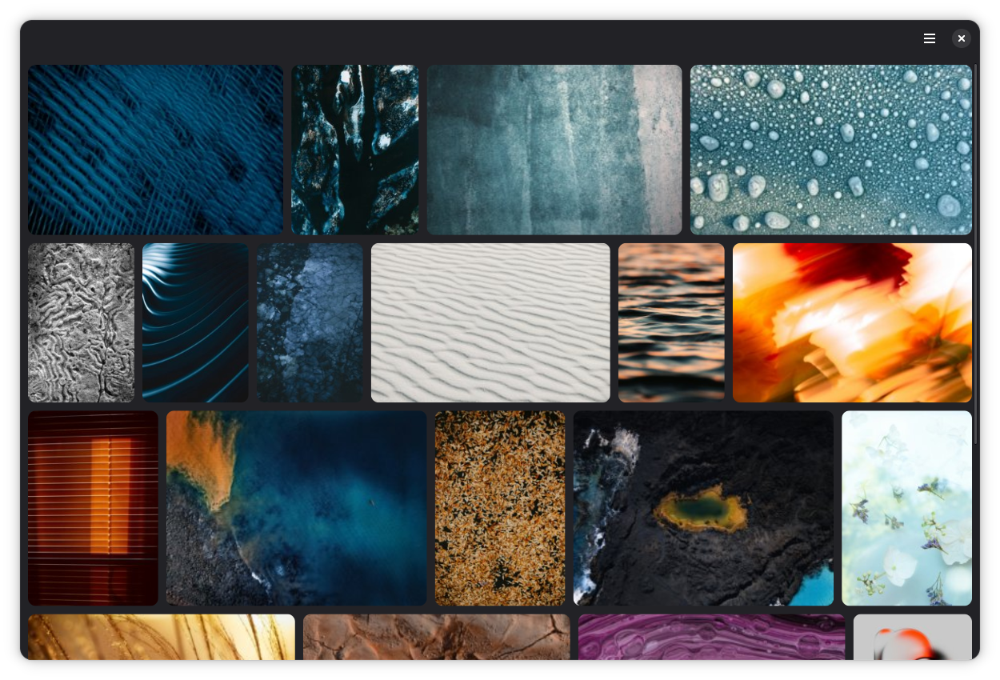

# Alusin Studio

An image editor for the GNOME desktop. The primary goal is to make [this dream](https://www.reddit.com/r/gnome/comments/1hnnzr3/trying_to_envision_a_gtk4based_raster_graphics/) come true. Note: this project has just been created. It's not currently doing anything.

This project is distributed under the [GNU Affero General Public License Version 3](LICENSE) (AGPL-3).